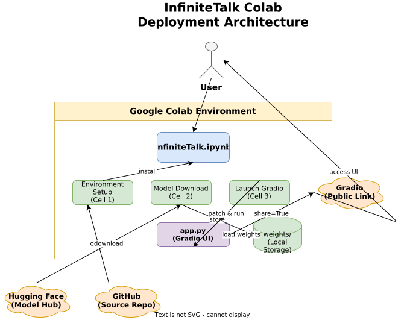
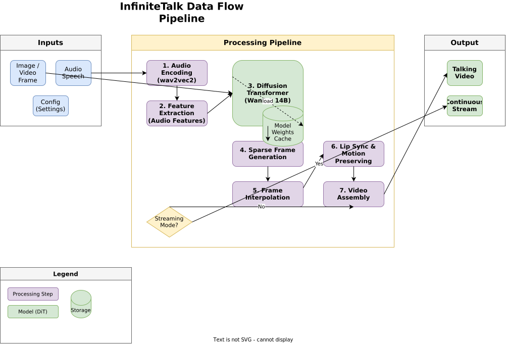

# InfiniteTalk Google Colab Deployment

[](https://colab.research.google.com/github/sruckh/InfiniteTalk-Google-Collab/blob/main/InfiniteTalk.ipynb)
[](https://colab.research.google.com/github/sruckh/InfiniteTalk-Google-Collab/blob/main/ComfyUI_InfiniteTalk.ipynb)
[](https://opensource.org/licenses/MIT)
[](https://www.python.org/downloads/)

> A streamlined, one-click solution for running **InfiniteTalk** on Google Colab — a state-of-the-art sparse-frame video dubbing framework that generates unlimited-length talking videos with high lip-sync accuracy and consistent identity preservation.

## Overview

InfiniteTalk is a cutting-edge audio-driven video generation framework developed by [MeiGen-AI](https://github.com/MeiGen-AI/InfiniteTalk). This repository provides a turnkey Jupyter Notebook deployment for Google Colab, enabling users to experiment with the model without complex local setup.

The framework supports both **image-to-video** and **video-to-video** dubbing, maintaining visual consistency across arbitrarily long output sequences through its innovative sparse-frame generation approach.

## Features

- **One-Click Setup**: Automated installation of complex dependencies including Flash Attention and xformers
- **Multi-Language Support**: English audio encoder by default, with Chinese as an optional alternative
- **Streaming Mode**: Generate videos beyond standard clip limits with continuous output
- **Gradio Web UI**: User-friendly interface with public URL sharing
- **GPU Optimization**: Configured for Colab's T4 GPU with aggressive memory offloading
- **Identity Preservation**: Maintains consistent character appearance across long videos
- **Lip-Sync Accuracy**: State-of-the-art audio-visual synchronization

## Architecture



The deployment consists of three main layers:

1. **Google Colab Environment** — GPU-enabled runtime container
2. **InfiniteTalk Pipeline** — Model loading, inference, and Gradio interface
3. **External Services** — Hugging Face (model weights), GitHub (source code), and Gradio (public tunnel)

### Data Flow



The processing pipeline transforms audio and visual inputs through seven stages:

1. **Audio Encoding** — wav2vec2 extracts audio features
2. **Feature Extraction** — Processes speech characteristics
3. **DiT Processing** — 14B Diffusion Transformer generates sparse frames
4. **Sparse Frame Generation** — Creates key frames at intervals
5. **Frame Interpolation** — Fills gaps for smooth playback
6. **Lip Sync & Motion** — Ensures audio-visual alignment
7. **Video Assembly** — Combines frames into final output

## Quick Start

### One-Click Launch

Click the **"Open in Colab"** button at the top of this README to launch the notebook directly in Google Colab. No download or upload required.

[](https://colab.research.google.com/github/sruckh/InfiniteTalk-Google-Collab/blob/main/InfiniteTalk.ipynb)

### Alternative: Manual Setup

If you prefer to download the notebook:

1. Download `InfiniteTalk.ipynb` from this repository
2. Open [Google Colab](https://colab.research.google.com/)
3. Go to **File** → **Upload notebook**
4. Select the downloaded file

### Prerequisites

| Requirement | Minimum | Recommended |
|-------------|---------|-------------|
| GPU Runtime | T4 (Free) | A100, L4 (Paid) |
| RAM | 12.7 GB+ | 25 GB+ |
| Storage | 30 GB | 50 GB+ |

### Installation

**GPU Runtime Setup (Required):**

1. In Colab, navigate to **Runtime** → **Change runtime type**
2. Under **Hardware accelerator**, select **T4 GPU** (or A100/L4 if available)
3. Click **Save**

### Execution

Run the notebook cells in order:

```python
# Cell 0: Verify GPU
!nvidia-smi

# Cell 1: Environment Setup
# - Clones InfiniteTalk repository
# - Installs PyTorch 2.4.1, xformers, Flash Attention
# - Installs project dependencies

# Cell 2: Download Models
# - Wan2.1-I2V-14B-480P (Base model)
# - wav2vec2-base-960h (English audio encoder - DEFAULT)
# - chinese-wav2vec2-base (Chinese audio encoder - optional, uncomment in notebook)
# - MeiGen-AI/InfiniteTalk (Inference weights)

# Cell 3: Launch Application
# - Patches app.py for public URL
# - Starts Gradio interface
```

### Access the Interface

After the final cell executes, locate the output line:

```
Running on public URL: https://xxxxxxxx.gradio.live
```

Click the link to open the InfiniteTalk web interface.

## Usage Examples

### Basic Image-to-Video

```python
# Via Gradio UI:
# 1. Upload a portrait image
# 2. Upload an audio file (WAV/MP3)
# 3. Set motion frames (default: 9)
# 4. Click "Generate"
```

### Streaming Mode (Long Videos)

```python
# Enable streaming in app.py:
python app.py \
    --ckpt_dir weights/Wan2.1-I2V-14B-480P \
    --wav2vec_dir weights/chinese-wav2vec2-base \
    --infinitetalk_dir weights/InfiniteTalk/single/infinitetalk.safetensors \
    --num_persistent_param_in_dit 0 \
    --motion_frame 9 \
    --streaming  # Enables continuous generation
```

## Configuration Parameters

| Parameter | Description | Default | Recommended Range |
|-----------|-------------|---------|-------------------|
| `--ckpt_dir` | Path to Wan2.1 base model | - | `weights/Wan2.1-I2V-14B-480P` |
| `--wav2vec_dir` | Audio encoder path | - | `weights/wav2vec2-base-960h` (English) or `weights/chinese-wav2vec2-base` (Chinese) |
| `--infinitetalk_dir` | InfiniteTalk weights | - | `weights/InfiniteTalk/single/` |
| `--num_persistent_param_in_dit` | Persistent parameters in GPU | 0 | 0-4 (Colab: 0) |
| `--motion_frame` | Motion context frames | 9 | 3-15 |
| `--streaming` | Enable infinite length | False | True for long videos |

## Model Weights

The notebook automatically downloads the following models from Hugging Face:

| Model | Size | Purpose |
|-------|------|---------|
| `Wan-AI/Wan2.1-I2V-14B-480P` | ~27 GB | Base Diffusion Transformer |
| `facebook/wav2vec2-base-960h` | ~380 MB | English audio encoder (DEFAULT) |
| `TencentGameMate/chinese-wav2vec2-base` | ~380 MB | Chinese audio encoder (optional) |
| `MeiGen-AI/InfiniteTalk` | ~1.2 GB | Audio-condition adapter weights |

### Alternative: Chinese Audio Encoder

```python
# In Cell 2, uncomment the Chinese download lines:
!huggingface-cli download TencentGameMate/chinese-wav2vec2-base --local-dir ./weights/chinese-wav2vec2-base
!huggingface-cli download TencentGameMate/chinese-wav2vec2-base model.safetensors --revision refs/pr/1 --local-dir ./weights/chinese-wav2vec2-base

# In Cell 3, update launch command:
!python app.py --wav2vec_dir 'weights/chinese-wav2vec2-base' ...
```

## Troubleshooting

### Common Issues

| Issue | Solution |
|-------|----------|
| **CUDA Out of Memory** | Ensure `--num_persistent_param_in_dit 0` is set. Try reducing `motion_frame` to 3-5. |
| **Slow Generation** | This is normal on T4 GPU. Upgrade to A100 for 3-5x speedup. |
| **Session Timeout** | Keep the Colab tab active. Avoid long idle periods. |
| **Gradio Link Not Showing** | Wait 1-2 minutes. Check if `share=True` is patched in app.py. |
| **Audio Sync Issues** | Ensure audio is 16kHz WAV. Try shorter audio clips first. |

### Performance Benchmarks

| Hardware | Resolution | FPS (Generation) | Memory |
|----------|------------|------------------|--------|
| T4 (Free) | 480p | ~0.5-1 | 12.7 GB |
| L4 | 480p | ~2-3 | 22 GB |
| A100 | 480p | ~5-8 | 40 GB |

## Technical Details

### Model Architecture

```
Input: Image (H×W×3) + Audio (16kHz WAV)
         ↓
Audio Encoder (wav2vec2) → Audio Features (512-dim)
         ↓
Diffusion Transformer (Wan2.1 14B)
         ↓
Sparse Frame Generator → Key Frames
         ↓
Temporal Interpolation → Full Frame Sequence
         ↓
Output: Video (H×W×3×T)
```

### Dependencies

```
torch==2.4.1
torchvision==0.19.1
torchaudio==2.4.1
xformers==0.0.28
flash_attn==2.7.4.post1
gradio>=4.0
transformers
diffusers
librosa
```

## Project Structure

```
infinitetalk/
├── InfiniteTalk.ipynb          # Main Colab notebook
├── README.md                   # This file
├── GEMINI.md                   # Gemini integration notes
├── _placeholder.py             # Serena project placeholder
└── docs/
    └── diagrams/
        ├── architecture.drawio # System architecture diagram
        └── data-flow.drawio    # Data flow pipeline diagram
```

## Contributing

Contributions are welcome! Areas for improvement:

- [ ] Add support for more audio languages
- [ ] Optimize memory usage for smaller GPUs
- [ ] Create Docker container for local deployment
- [ ] Add batch processing capabilities
- [ ] Improve frame interpolation quality

## Citation

If you use InfiniteTalk in your research, please cite the original work:

```bibtex
@misc{infinitetalk2024,
  title={InfiniteTalk: Audio-Driven Talking Video Generation},
  author={MeiGen-AI},
  year={2024},
  howpublished={\url{https://github.com/MeiGen-AI/InfiniteTalk}}
}
```

## Credits

- **InfiniteTalk Framework** — [MeiGen-AI](https://github.com/MeiGen-AI/InfiniteTalk)
- **Base Model** — [Wan-AI/Wan2.1-I2V-14B](https://huggingface.co/Wan-AI)
- **Audio Encoders** — [Facebook wav2vec2](https://huggingface.co/facebook), [Tencent GameMate](https://huggingface.co/TencentGameMate)
- **Colab Deployment** — This repository

## License

This project is licensed under the MIT License — see the [LICENSE](LICENSE) file for details.

The original InfiniteTalk framework may have its own license. Please refer to the [official repository](https://github.com/MeiGen-AI/InfiniteTalk) for specific terms.

## Acknowledgments

- Google Colab team for providing free GPU access
- Hugging Face for model hosting infrastructure
- The open-source AI community for foundational tools
